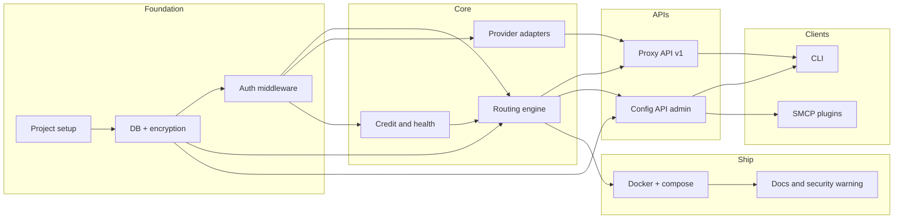

# Sanctum Router — Phase 1 Implementation Plan

**Source of truth:** [PRD.md](PRD.md). All behavior and schemas are specified there; this plan only orders work and calls out deliverables.

---

## Dependency order (high level)

Routing engine depends on **adapter interfaces** (defined early); concrete adapters and credit/health can be implemented in parallel. RE can be developed with mock/stub adapters.

---

## 1. Project setup and layout

**Goal:** Repo layout, tooling, and config parsing so all later work has a single place to plug in.

- **1.1** Create Python project under `sanctum-router/`: `pyproject.toml` (or `setup.py`), `requirements.txt`, virtualenv. Python 3.10+.
- **1.2** Adopt FastAPI as the single app: one ASGI app, mount or include routes for `/v1/*` (proxy) and `/admin/*` (config). No separate processes.
- **1.3** Config loading: support YAML config file (path from env, e.g. `ROUTER_CONFIG`) and ENV overrides. Parse at least: `server.port`, `server.admin_bind_localhost_only`, `providers` (id, endpoint, api_key, models, priority, credit_threshold, supports_tools, supports_streaming, supports_multimodal), `routing.strategy`, `routing.cost_optimization`, `monitoring.credit_check_interval`. Ref: PRD §9 Sample Configuration.
- **1.4** Env contract: document and read `ROUTER_CLIENT_KEY`, `ROUTER_ADMIN_KEY`, `ROUTER_ENCRYPTION_KEY` (for DB credential encryption), `ROUTER_DB_PATH` (default e.g. `/data/router.db`), `ROUTER_CONFIG` (optional YAML path). PRD §6 Config API, §12 Persistence & secrets.
- **1.5** Single entrypoint: one process, one listener. Bind the **whole** router to `127.0.0.1` by default (localhost-only); port from config (e.g. 8480). Do not run two listeners for /admin; rely on Docker port mapping (e.g. `127.0.0.1:8480:8480`) so the host exposes only what you map. PRD §7 Architecture.

**Exit criteria:** App starts; config and env are loaded; no routes yet.

---

## 2. Database and credential encryption

**Goal:** SQLite as single source of truth; provider credentials encrypted at rest; no plaintext in DB or logs.

- **2.1** Implement schema from PRD § Database schema (SQLite): `providers`, `routing_config`, `provider_priority`, `failover_conditions`, `model_aliases`, `agent_override`. **Do not implement `request_logs`;** no request/usage logging to DB in Phase 1. Use migrations or a single `init_db()` that runs on startup and is idempotent. Set `PRAGMA journal_mode=WAL; PRAGMA synchronous=NORMAL;` for SQLite to reduce contention under config writes.
- **2.2** DB path: use `ROUTER_DB_PATH`; ensure directory exists; document that Docker must mount a persistent volume (e.g. `/data`) for that path. PRD §7 Local SQLite DB.
- **2.3** Credential encryption: use `ROUTER_ENCRYPTION_KEY` (env) with a symmetric cipher (e.g. Fernet or AES) to encrypt `api_key` before writing to `providers.api_key_encrypted` and decrypt only in memory when calling a provider. Never log or return decrypted keys. PRD §12 Persistence & secrets, §6 Provider Management.
- **2.4** Optional bootstrap: on first run, if DB has no providers and a YAML/ENV provider list exists, seed `providers` (and optionally `routing_config`, `provider_priority`, `failover_conditions`) from config; encrypt API keys during seed. PRD § Database schema Notes.
- **2.5** Data access layer: abstract all DB access behind a small module (e.g. `router/db.py` or `router/repository.py`) so routes and routing engine never touch SQL directly. Clear functions for: provider CRUD, routing_config get/set, provider_priority get/set, failover_conditions get/set, model_aliases get/set, agent_override get/set by session_id.

**Exit criteria:** DB initializes; providers can be inserted/updated with encrypted api_key; no plaintext secrets in DB or logs.

---

## 3. Authentication middleware and session correlation

**Goal:** Split auth for `/v1/*` vs `/admin/*`; session_id for overrides derived from Bearer token or `X-Router-Session-Id`.

- **3.1** Middleware or dependency: for `/v1/*` require `Authorization: Bearer <ROUTER_CLIENT_KEY>` (or allow unauthenticated if keys not set, for dev only—document that prod must set keys). For `/admin/*` require `Authorization: Bearer <ROUTER_ADMIN_KEY>` or `X-API-Key: <ROUTER_ADMIN_KEY>`. Return 401 with OpenAI-style error body when missing or invalid. PRD § Config API (enumeration), §6 Config API.
- **3.2** Session ID helper: define `get_session_id(request) -> str`: if header `X-Router-Session-Id` present, use it; else use `hash(Authorization Bearer token)`. Use this for all `/admin/override` writes and for proxy request routing when looking up `agent_override`. PRD § Config API Session correlation, § Database schema Notes.
- **3.3** Key default: allow `ROUTER_ADMIN_KEY` and `ROUTER_CLIENT_KEY` to be the same value; document that when they differ, clients must send `X-Router-Session-Id` on both admin and proxy requests so overrides apply to the right session. PRD § Config API Key default.

**Exit criteria:** Unauthorized requests to `/v1/*` and `/admin/*` get 401; session_id is stable per token and overridable by header.

---

## 4. Routing engine (core logic)

**Goal:** Deterministic routing: priority order, capability gating, failover (credit + health), agent override; no "AI complexity" in Phase 1.

- **4.1** Provider order: compute ordered list of providers from `provider_priority` table if present, else from `providers.priority` (and config seed). Use this order for "try first, then next on failover."
- **4.2** Capability gating: given an incoming proxy request, filter the ordered provider list to only those with: `supports_tools=true` if request has `tools`; `supports_streaming=true` if request has `stream: true`; `supports_multimodal=true` if request is multimodal. **Multimodal (MVP):** treat request as multimodal iff any message content item has `type: "image_url"` or `type: "input_image"`. If structure is unknown, treat as non-multimodal. PRD §6 Routing Logic, §12 Routing rules.
- **4.3** Override: if `agent_override` has a row for the request's `session_id` with non-null `provider_id`, force that provider (if it's in the filtered list and healthy); otherwise use normal order.
- **4.4** Failover: when calling a provider, if the call fails (timeout, 5xx, or health check failed), mark provider unhealthy (update `providers.healthy` or in-memory cache) and try next in list. Health-based failover: use a background health checker (or on-request timeout) to set `healthy`. Credit threshold: when a provider's credit balance (from credit monitor) is below its `credit_threshold`, treat as unavailable for routing. PRD §12 Routing rules, §6 Credit Awareness.
- **4.5** Model ID resolution (namespace not binding): resolve request `model` to a canonical identifier using `model_aliases` if present; otherwise use as-is. The canonical `<provider>+<model>` is an **identifier**, not a hard binding: **on failover, the router may route to a different provider that declares the same upstream model name** (or has an alias mapping). So e.g. request `venice+kimi-k2` can fail over to a provider that lists `kimi-k2` in `providers.models`. Route only to providers that list that upstream model (or alias to it). PRD § Model IDs namespace not binding, § Database schema.
- **4.6** Response headers: after successfully proxying, set `X-Router-Provider` to the provider id that served the request; optionally `X-Router-Upstream-Model` (model id sent to backend). Response body `model` must echo the client's requested model id (canonical or alias). PRD § Model IDs: namespace not binding.

**Exit criteria:** Given a request (model, tools, stream, multimodal) and current DB state, the engine returns an ordered list of candidate providers and the chosen one; failover and override behavior match PRD.

---

## 5. Provider adapters (HTTP client to backends)

**Goal:** Call OpenAI-compatible backends (Venice, Featherless, local, etc.); handle request/response and errors in OpenAI shape.

- **5.1** Abstract adapter interface: e.g. `async def call_chat_completions(provider_id, endpoint, api_key_decrypted, model_upstream, body, stream) -> (response_body, status, headers)`. Same for embeddings. All adapters speak OpenAI-style JSON; no provider-specific paths in the proxy (only endpoint and key differ). PRD §7 Provider Adapters.
- **5.2** Implement one generic "OpenAI-compatible" adapter: POST to `{endpoint}/chat/completions` and `{endpoint}/embeddings` with forwarded body (after rewriting `model` to upstream model id). **Model rewriting (crisp rule):** if request model is `provider+model`, upstream model = the model part; if request model is an alias, resolve via `model_aliases` to canonical, then upstream model = canonical's model part. Forward `Authorization: Bearer <decrypted_key>`; return response as-is (or normalize to OpenAI error shape on 4xx/5xx). PRD § Full OpenAI API compatibility.
- **5.3** Streaming: for `stream: true`, stream response chunks (SSE) from backend to client; do not buffer entire response. Pass through chunk shape. PRD § Full OpenAI API compatibility Streaming.
- **5.4** Timeouts and circuit breaker: configurable timeout per request (e.g. 60s); on timeout or repeated failures, mark provider unhealthy (and optionally implement a simple circuit breaker so we don't hammer a down provider). PRD §7 Reliability/Security.

**Exit criteria:** Any OpenAI-compatible backend can be added via config/DB; chat/completions and embeddings (streaming and non-streaming) work through the adapter.

---

## 6. Credit and health monitor

**Goal:** Periodic credit/balance per provider; health checks; state for routing. **Phase 1: credit and health state in memory only**; DB stores only provider settings and thresholds (no credit/health tables).

- **6.1** Credit source (MVP): define a minimal interface "get_credit_balance(provider_id) -> optional float or None". For Venice/Featherless (or others), implement one adapter per provider type that calls a known credit API or returns None if unavailable. If no API, credit is "unknown" and threshold check can be skipped for that provider. PRD Appendix Credit Model (open).
- **6.2** Background task: run a loop (interval from `monitoring.credit_check_interval`, e.g. 300s) that updates credit state and marks "below threshold" when balance < provider's `credit_threshold`. **Store credit balances in memory only**; do not add credit tables to DB. `/admin/credit` reports from this in-memory state (and "unknown" when unavailable). Routing engine reads from the same in-memory state. PRD §6 Credit Awareness, §12 Routing rules.
- **6.3** Health checks: periodic HTTP GET to each provider's endpoint (e.g. `/v1/models` or a health URL) or on first request; on failure/timeout set provider unhealthy **in memory**; do not persist health to DB in Phase 1. Routing engine uses this to exclude providers. PRD §6 Provider Management, §12 Health-based failover.

**Exit criteria:** Credit and health state are available to the routing engine; failover when credit below threshold or health check fails.

---

## 7. Proxy API (`/v1/*`)

**Goal:** OpenAI-compatible endpoints; routing engine + adapters; correct headers and response model.

- **7.1** `GET /v1/models`: Auth via ROUTER_CLIENT_KEY. Build list from DB only: for each provider, for each model in `providers.models`, emit `{ "id": "<provider>+<model>", "object": "model", "created": <ts>, "owned_by": "<provider>" }`; add entries for `model_aliases` (alias as id, or expand to canonical). Do not call upstream `/v1/models`. PRD § Full OpenAI API compatibility GET /v1/models.
- **7.2** `POST /v1/chat/completions`: Auth; parse body; derive session_id; apply capability gating (tools, streaming, multimodal using the MVP detector above); apply override; resolve model; run routing engine and call chosen provider adapter. Return response as-is; set `X-Router-Provider` and optionally `X-Router-Upstream-Model`; ensure response `model` echoes request model id. On all provider failures return 502/503 with OpenAI-style error JSON and `x-request-id` if available. PRD § Full OpenAI API compatibility POST /v1/chat/completions.
- **7.3** `POST /v1/embeddings`: Same auth and routing (no tools/multimodal; streaming N/A). Forward to provider; add headers; echo `model` in response. PRD § Full OpenAI API compatibility POST /v1/embeddings.
- **7.4** Errors: map backend and router errors to HTTP status and body `{ "error": { "message", "type", "code" } }`. PRD § Full OpenAI API compatibility Errors.
- **7.5** Do not log requests to DB. No `request_logs` table or request/usage logging in Phase 1. PRD: request logging to DB removed.

**Exit criteria:** Letta (or any OpenAI client) can point at the router with base URL + ROUTER_CLIENT_KEY and use /v1/models, /v1/chat/completions, /v1/embeddings (streaming and non-streaming) with correct behavior and headers.

---

## 8. Config API (`/admin/*`)

**Goal:** All admin endpoints implemented; mutations persist to SQLite; auth and session for override.

- **8.1** `GET /admin/status`: Return JSON with status, version, current_provider, providers_healthy, uptime_seconds. PRD § Config API table.
- **8.2** `GET /admin/providers`: List providers from DB (no decrypted keys); include id, endpoint, models, priority, healthy, supports_tools, supports_streaming, supports_multimodal, credit_threshold. PRD § Config API table.
- **8.3** `POST /admin/providers`: Validate body; allowed fields include endpoint, models, priority, credit_threshold, supports_tools, supports_streaming, supports_multimodal, api_key; encrypt api_key if present; insert into `providers`; return 201 + provider object (no raw key). PRD § Config API table.
- **8.4** `PATCH /admin/providers/{id}`: Update allowed fields (endpoint, models, priority, credit_threshold, supports_tools, supports_streaming, supports_multimodal, api_key); re-encrypt if api_key provided. PRD § Config API table.
- **8.5** `DELETE /admin/providers/{id}`: **Cascade cleanup**: delete the provider and all rows that reference it: provider_priority, failover_conditions, and agent_override rows **where provider_id = <id>** (do not delete other providers' overrides). Do not reject delete when referenced; remove dependents so ops stay simple. PRD § Config API table.
- **8.6** `GET /admin/credit`: Return per-provider balance, currency, below_threshold from credit monitor state. PRD § Config API table.
- **8.7** `POST /admin/override`: Body `{ "provider_id": "<id>" | null }`. Derive session_id from request (Bearer or X-Router-Session-Id); upsert `agent_override` for that session_id; return ok and current_provider. PRD § Config API table, § Session correlation.
- **8.8** `POST /admin/estimate-cost`: Body model, prompt_tokens, completion_tokens. Return estimated_cost, currency, model, tokens (MVP: can return placeholder or static table lookup). PRD § Config API table.
- **8.9** `GET /admin/routing-config`: Return strategy, provider_order (from provider_priority or providers.priority), failover (from failover_conditions). PRD § Config API table.
- **8.10** `PUT/PATCH /admin/routing-config`: Update routing_config singleton and provider_priority / failover_conditions tables; return updated config. PRD § Config API table.

**Exit criteria:** CLI and SMCP plugins can drive all config and override behavior via HTTP only; no direct DB access from outside the container.

---

## 9. CLI (thin HTTP client)

**Goal:** CLI that calls Config API (and optionally proxy) so humans and scripts can manage router from the host.

- **9.1** CLI entrypoint: e.g. `router-cli` or `python -m router.cli`; reads `ROUTER_URL` and `ROUTER_ADMIN_KEY` for admin; `ROUTER_CLIENT_KEY` for any proxy check. PRD §6 CLI.
- **9.2** Commands map to Config API: e.g. `router-cli status` → GET /admin/status; `router-cli providers list` → GET /admin/providers; `router-cli providers add ...` → POST /admin/providers; `router-cli providers remove <id>` → DELETE /admin/providers/{id}; `router-cli routing get` → GET /admin/routing-config; `router-cli routing set ...` → PUT /admin/routing-config; `router-cli override set <id>` → POST /admin/override; `router-cli credit` → GET /admin/credit. PRD §6 Provider Management, § Config API (enumeration).
- **9.3** Output: human-readable (table or lines) and/or JSON flag for scripting. Help text for every command. PRD §8 Usable out-of-the-box.
- **9.4** UCW-wrapable: ensure CLI is invokable with args and returns structured output so UCW can wrap it for SMCP plugin generation. PRD §6 Agent Integration, §7 SMCP/UCW.

**Exit criteria:** From host, with ROUTER_URL and ROUTER_ADMIN_KEY set, operator can list/add/remove providers, get/set routing, set override, check credit and status.

---

## 10. SMCP plugins

**Goal:** Ship plugin(s) that expose router status, providers, credit, override, routing config, and estimate_cost as SMCP tools; plugins call Config API only.

- **10.1** Plugin layout: follow sanctumos/smcp plugin structure (e.g. `plugins/sanctum_router/` with `cli.py` or equivalent so SMCP server can discover and run tools). PRD §6 Agent Integration, Ecosystem SMCP.
- **10.2** Tool implementations: each tool is implemented by HTTP calls to the router's Config API (ROUTER_URL + ROUTER_ADMIN_KEY). **Override session correlation (explicit):** If `ROUTER_ADMIN_KEY` and `ROUTER_CLIENT_KEY` differ, the plugin **must** send `X-Router-Session-Id` on override calls, and the **inference client** (Letta, etc.) **must** send the same `X-Router-Session-Id` header on `/v1/*` requests, or overrides will not apply to that client's requests. When keys are the same, token hash ties session and no header is needed. Document this bluntly. PRD §6 Plugin tools, § Config API.
- **10.3** Ship: include plugin directory in repo (or installable package) so users can copy into MCP_PLUGINS_DIR; do not ship an MCP server in the Docker image. PRD §6 Agent Integration, §7 SMCP/UCW.
- **10.4** Docs: warn that loading SMCP tools with write/admin access is an intentional security boundary and should only be used in trusted/local environments. PRD §12 Security posture.

**Exit criteria:** With SMCP server (e.g. sanctumos/smcp) running on host and plugin loaded, agent can call get_router_status, list_providers, get_credit_status, select_provider, estimate_cost, get_routing_config, set_routing_config; state changes persist in router DB.

---

## 11. Docker and deployment

**Goal:** Single container, configurable non-default port, persistent volume for DB, healthcheck.

- **11.1** Dockerfile: Python base (slim); install app and deps; expose single port (e.g. 8480); set ROUTER_DB_PATH to /data/router.db; volume mount point /data. No MCP server in image. PRD §7 Architecture, §9 Sample Configuration.
- **11.2** docker-compose (or demo compose): service that mounts `/data` (or named volume) for persistence; env file or env vars for ROUTER_CLIENT_KEY, ROUTER_ADMIN_KEY, ROUTER_ENCRYPTION_KEY, optional ROUTER_CONFIG path (mount YAML); port mapping e.g. 127.0.0.1:8480:8480 (localhost-only on host). PRD §7, §12 Persistence.
- **11.3** Healthcheck: HTTP GET to /v1/models or a dedicated /health that returns 200 when app and DB are up. PRD §7 Healthcheck endpoint.
- **11.4** Default bind: bind the **whole** router to `127.0.0.1` by default. Use Docker port mapping (e.g. `ports: ["127.0.0.1:8480:8480"]`) so the host only exposes what you map; no separate bind for /admin. Document that public exposure is not recommended. PRD §12 Security posture.

**Exit criteria:** `docker compose up` brings up router; DB persists across restarts; healthcheck passes; setup-to-use under 15 min with docs.

---

## 12. Documentation and final hardening

**Goal:** One place for "how to run," env reference, security warning, and PRD reference.

- **12.1** README (or docs): quick start (clone, env, compose up); env var reference (ROUTER_*); link to PRD; security warning (Config API and SMCP write are powerful; localhost-only; trusted env only). PRD §12 Security posture, §8 Usable out-of-the-box.
- **12.2** Optional: single "Deployment" or "Security" section that restates §12 MVP Decisions (network isolation, no RBAC, no prompt/completion storage, DB as source of truth). PRD §12.

**Exit criteria:** New user can start router and call proxy + admin; security posture is clearly stated.

---

## Suggested implementation order (single stream)

1. **Project setup** (1.1–1.5)
2. **DB + encryption** (2.1–2.5)
3. **Auth + session** (3.1–3.3)
4. **Adapter interface** (5.1): define interface so RE can use stubs.
5. **Provider adapters** (5.2–5.4) and **Credit/health monitor** (6.1–6.3) — can proceed in parallel after 2–3.
6. **Routing engine** (4.1–4.6) — uses DB, adapter interface (mock or real), credit/health state.
7. **Proxy API** (7.1–7.5) — uses routing engine + adapters
8. **Config API** (8.1–8.10) — uses DB and session_id
9. **CLI** (9.1–9.4) — uses Config API
10. **SMCP plugins** (10.1–10.4) — uses Config API
11. **Docker + compose** (11.1–11.4)
12. **Docs and hardening** (12.1–12.2)

Parallelization: 4 (Provider adapters) and 5 (Credit/health) can proceed in parallel after 2–3; 9 (CLI) and 10 (SMCP) can proceed in parallel after 8.
